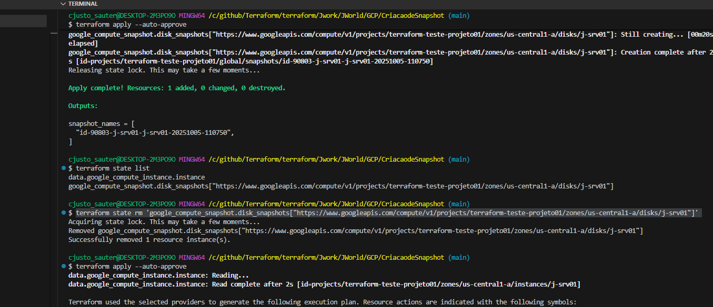

-------------------------
SAUTERS
-------------------------

Objetivo deste terraform é facilitar a atividade de tirar snapshot das maquinas antes de executar alguma manutenção.
para utiliza-lo antes de dar o terraform plan apenas vá no arquivo terraform.tfvars e mude as variaveis que voce preciso

IMPORTANTE!!!!
Terraform tem como padrão controlar todos os objetos que ele criar se voce criar um snapshot por ele e troca a maquina para criar um novo snapshot 
por conceito do terraform ele vai destruir os terraform antigos, o que faria sentido se a gente fez uma gmud ,ja validou e não dos snapshoot antes
porém se voce deseja não apagar os snapshot voce precisa apagar o estado destes objetos no tfstate sendo assim execute o seguintes passos:

terraform state list

Vai paracer o nome dos objetos pegue eles e apague cada um deste como no exemplo abaixo:

google_compute_snapshot.disk_snapshots["https://www.googleapis.com/compute/v1/projects/terraform-teste-projeto01/zones/us-central1-a/disks/j-srv01"]

Desta maneira quando vc fizer terraform apply ele não apagara nenhum disco e sempre criará novos